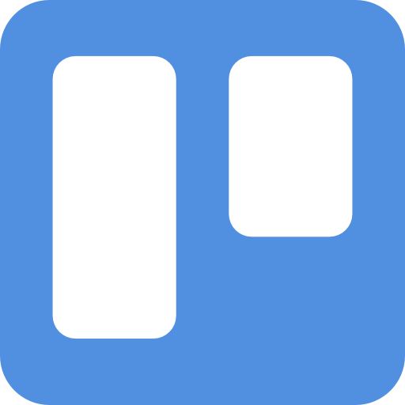

# React + Vite

This template provides a minimal setup to get React working in Vite with HMR and some ESLint rules.

Currently, two official plugins are available:

- [@vitejs/plugin-react](https://github.com/vitejs/vite-plugin-react/blob/main/packages/plugin-react/README.md) uses [Babel](https://babeljs.io/) for Fast Refresh
- [@vitejs/plugin-react-swc](https://github.com/vitejs/vite-plugin-react-swc) uses [SWC](https://swc.rs/) for Fast Refresh

---

# Perfil Tecnico

_Soy una persona proactiva la cual me gusta aprender muchas cosas, una de ellas es la programacion o desarrollo de aplicaciones, me gusta tambien trabajar en equipo, me gusta realizar proyectos en el cual pueda desempeñar mis cualidades y tambien aprender mas tanto de los proyectos como de mis compañeros._

# Como Sigo Aprendiendo

_Busco para aprender: videos de youtube, o informacion en internet que me de varias ideas para realizar lo que estoy buscando, de igual forma sigo a creadores de contenido en desarrollo como HolaMundo, BettaTech, CodeGym, CodeReview, Brais Moure entre otros y paginas como Boostrap, MDM Web Docs, W3schools, tambien varias mas que me ayuden a implementar en los proyectos a realizar._

# Realizacion del Proyecto

_Este proyecto es mi portafolio o CV en el cual muestra los proyectos realizados anteriormente y mis habilidades las cuales tengo conocimiento, el proyecto lo realize en la biblioteca de React.js Vite, en el cual contiene un_

## NavHeader

_Que es la parte de navegacion la cual cuenta con 4 botones Inicio, Proyectos, Sobre Mi, Contacto cada boton te dirige al sitio donde se puede ver la definicion._

## Inicio

_Muestra el titulo en lo que me desempeño y una foto aleatoria y un boton el cual se dirige a los proyectos que e realizado._

## About Me

_Muestra una foto mia y una descripcion de lo que me gusta realizar, un poco de mis habilidades personales y como puedo ayudar en los proyectos._

## Mis Habilidades

_Aqui muestro mis habilidades laborales o en las tecnologias en las que e realizado mis proyectos._

## Mis Proyectos

_Aqui muestro un poco los trabajos Personales que e realizado y en diferentes tecnologias como React, SASS, Boostrap y varias mas._

## Redes

_En Redes muestra una barra lateral derecha las cuales muestra mis redes sociales o de trabajo las cuales en el momento son GitHub y Linkedin._

## Footer

_En el footer muestro mis redes sociales y el Copyright._

# Componentes o Mejoras para el Proyecto

_Organizaria los componente, le pondria algo como tipo carrucel al tema de mis habilidades y en los proyectos haria como una reorganizacion del proyecto._

# Mis Habilidades

- React.js (Intermedio) 
- Java (Bajo) 
- JavaScript (Intermedio) 
- Kotlin (Bajo) 
- Docker (Bajo) 
- MySQL (Bajo) 
- Postman (Intermedio) 
- GitHub (Intermedio) 
- Figma (Intermedio) 
- Trello (Bajo) 

# Que es Markdown

_Es un lenguaje demarcado de texto plano que utiliza caracteres especiales en los cuales utiliza simbolos conocidos y accesibles en todo tipo de teclados como ejemplo #, /, \_, +, tambien sirve para documentar proyectos, y se puede transcribir a otros tipos de lenguajes._
